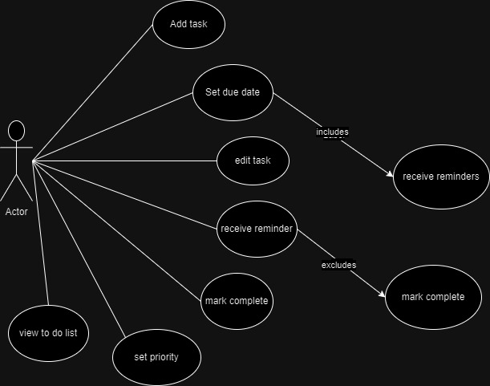

# Project for 3112

## Project Proposal ~ To-Do List app

### Description
- An application that allows users to create tasks set deadlines, receive reminders, check off tasks, and categorize tasks by priority

**Rationale**
- The app helps users to keep track of tasks in order to stay organized and productive. It is useful for anyone that needs a simple way to manage tasks, such as students or busy professionals.

**Description**
- This To-Do List app lets users add/edit tasks, set due dates, get reminders, check off completed tasks, and mark tasks by priority (High, Medium, Low). The app will be simple and easy to use.

**Functional**
  - Add Task: Allows the user to create new tasks.
  - Set Due Date: Lets the user assign a deadline to the task.
  - Edit Task: The user can edit an existing task.
  - Receive Reminder: The user gets reminders about upcoming deadlines.
  - Mark Complete: The user can mark tasks as done.
  - Set Priority: Users can assign priority levels (e.g., high, medium, low) to tasks.
  -  View To-Do List: Allows the user to view their current tasks.

**Nonfunctional**
  - Easy to Use: The app should be simple and quick to learn.
  - Fast: The app should load quickly and respond smoothly.
  - Works Everywhere: It should work on iOS, Android, and web browsers.
  - Reliable: It shouldn’t crash or lose user data.
  - Secure: User info should be protected.

### Use Case Diagram

**Description** 
- Actors:
  - User: The individual using the app, represented by the "Actor" figure on the left.
- Includes Relationship:
  - Set Due Date includes Receive Reminder: When the user gives a task a due date, reminders will automatically be scheduled.
  - Excludes Relationship:
        Receive Reminder excludes Mark Complete: Receiving a reminder does not automatically mark the task as complete. The user has to manually perform this action
